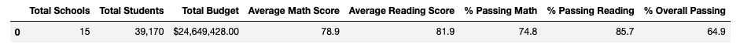
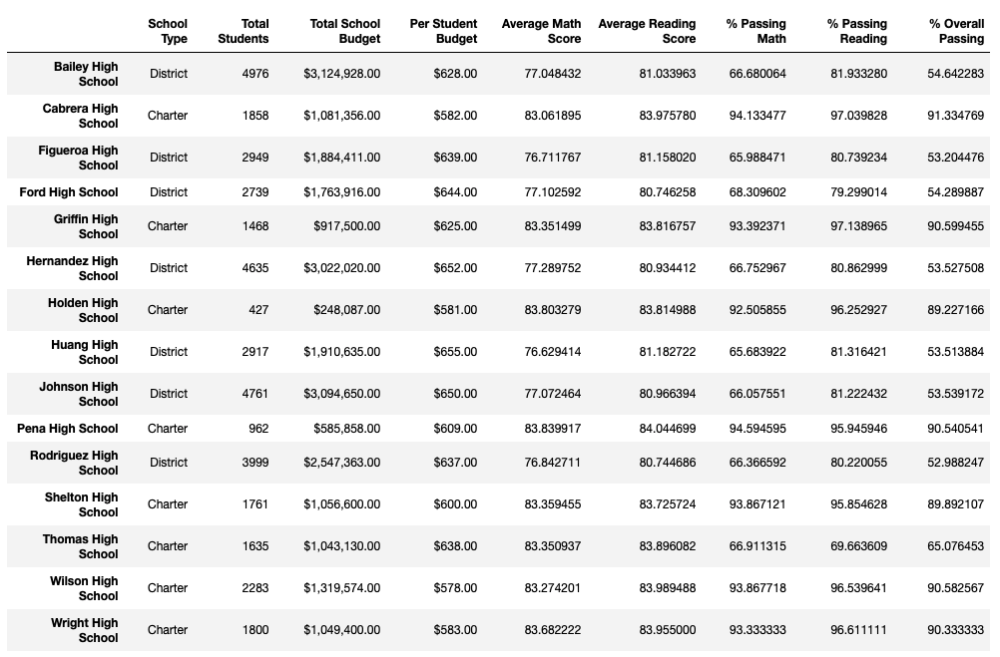
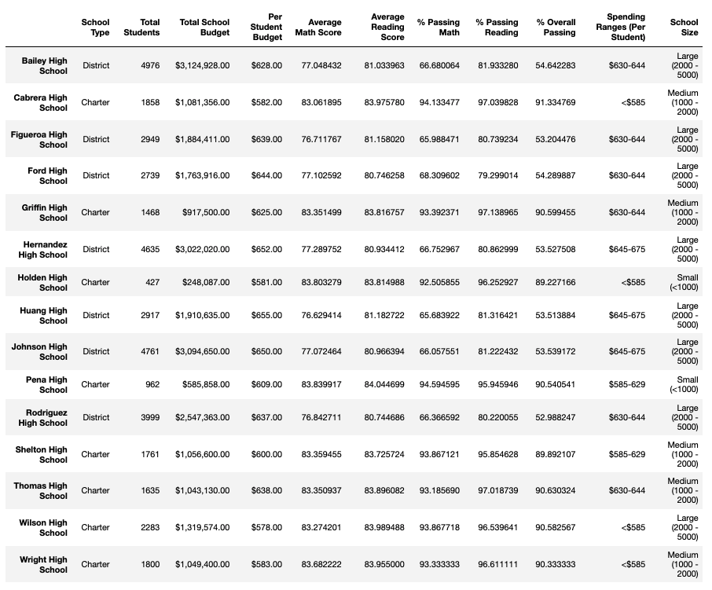
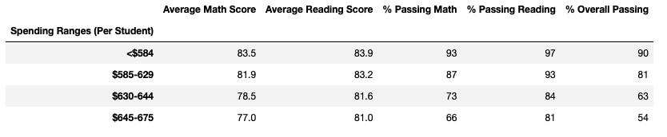
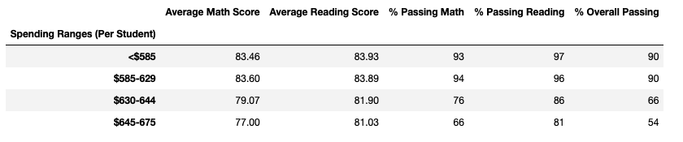

# **Overview of School District Analysis**

The purpose of this school distrcit analysis project is to follow up on the original district analysis that was conducted in light of new information. With information from Maria that the grades for ninth graders at Thomas High School appear to have been altered we want to rerun the analysis to exclude the data for Thomas High School ninth graders. For this project, we want to keep the dataset intact and only exlcude the math and reading scores for the Thomas High School ninth graders. We will run our previous district analysis with this modified dataset to determine if there are any changes to the overall distrcit analysis.

# **Results**

* **District summary analysis:**
    * The district analysis is not impacted very much at all by excluding the Thomas High School ninth grade data.
    * Average math and reading scores along with % passing math, passing reading, and overall passing were similar to what was observed in our initial district analysis.
    * Screenshot of district summary dataframe:
    
* **School summary analysis:**
   * In our school summary analysis, we updated the number of total students for Thomas High School to include only the count of students from 10-12th grade. We used this number as our new total students for Thomas High School to calculate the passing percentages.   
   * The observed differences to our school summary analysis are the % Passing Math, % Passing Reading, and % Overall Passing numbers for Thomas High School.
   * These percentages are higher in our new analysis compared to the initial analysis.
   * Screenshot of initial school summary dataframe:
   
   * Screenshot of adjusted school summary dataframe (excluding count of Thomas High School ninth graders):
   
   * In our initial analysis, Thomas High School was the second top performing school and their ranking is not affected when we excluded the ninth grade data. The high school still shows up in the top 5 schools dataframe as the second school.
* **Math & reading scores by grade:**
   * Aside from changing the ninth grade data for Thomas High School to NaN values, the rest of dataset was kept intact and no modifications were done to any other pieces of the data. This said, there were no observed changes to the math and reading scores by grade level and by school.
   * The only observed difference was the values for ninth grade math and reading scores. Instead of a mean value, those amounts were replaced with NaNs.
* **Scores by school spending:**
    * The observed difference in our analysis for scores by school spending were increases to the passing scores and passing percentages for the schools with smaller spending buckets, specifically for schools falling into the $585-629 and $630-644 spending buckets.
    * Screenshot of initial scores by spending summary dataframe:
    
    * Screenshot of adjusted scores by spending summary dataframe:
       
* **Scores by school size:**
    * No observed differences in scores by school size.
* **Scores by school type:**
    * No observed differences in scores by school type. 
 
 # **Summary**
 In conclusion, our new analysis of the district scores analysis revealed a few observed differences in school district metrics that were analyzed, however the majority of the metrics remained the same. The changes to the school district analysis observed were reportedly differences in the percentage scores (% passing math, % passing reading, and overall passing %) for Thomas High School and average scores by school spending for schools falling into the smaller spending buckets (specifically $585-629 and $30-644.
